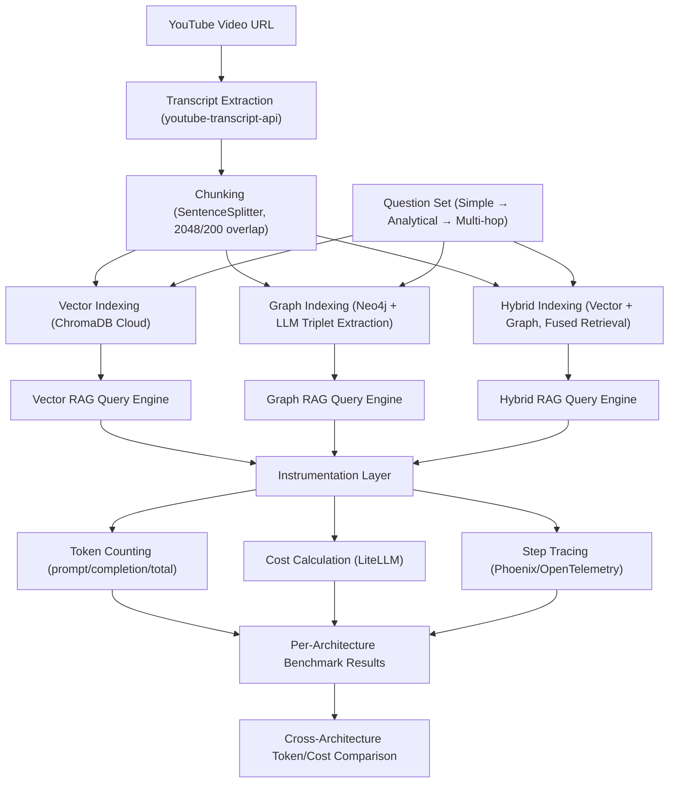

# 🔍 RAG Token & Cost Benchmark: Vector vs Graph vs Hybrid


## 📌 Overview

This project benchmarks **token consumption and inference cost** across three Retrieval-Augmented Generation (RAG) architectures (**Vector RAG**, **Graph RAG**, and **Hybrid RAG**) when answering the same set of questions (increasing in complexity: simple, analytical, multi-hop) over the same YouTube video transcript.

Each architecture is instrumented with a token counter, a step-level debug tracer, and a cost calculator, so every answer comes with a transparent breakdown of prompt tokens, completion tokens, total tokens, and estimated USD cost. This allows a direct, apples-to-apples comparison of what each architecture actually costs to run, not just how well it answers.

> **Status:** 🟢 Complete. Vector RAG, Graph RAG, and Hybrid RAG benchmarks have all been run on the same transcript and question set.

---

## 🎯 Context & Problem Statement

### 💬 The Practical Problem
Graph RAG and Hybrid RAG are frequently recommended over plain Vector RAG for their supposedly richer, more relational context, but that recommendation almost never comes with a number attached. In practice, building a Graph or Hybrid pipeline means paying for **two extra, non-trivial cost centers** that Vector RAG doesn't have: (1) an LLM-driven triplet extraction step to populate the knowledge graph during ingestion, and (2) typically longer, more elaborate LLM completions at query time. For anyone operating under a **limited API quota** (students, researchers, or hobbyists on free-tier keys), adopting a "better" architecture without knowing this upfront can mean running out of quota mid-experiment, with no way to know in advance whether the answer-quality gain was even worth the extra spend.

### 💡 The Solution & Engineering Approach
This project answers a narrow, concrete question: **for the exact same transcript and the exact same 3 questions, how many more tokens, and how many more dollars, does each additional layer of RAG sophistication (Vector to Graph to Hybrid) actually cost?** Rather than debating this in the abstract, each architecture is built end-to-end and instrumented identically with:
* 🔢 **Token accounting** via `TokenCountingHandler` (prompt / completion / total tokens per turn).
* 🐞 **Step-level tracing** via `LlamaDebugHandler` (retrieval → reranking → synthesis → LLM latency breakdown).
* 💰 **Cost estimation** via LiteLLM's `completion_cost()`, mapped against the actual model used per call.
* 📊 **Distributed tracing** via Arize Phoenix (OpenTelemetry) for full observability of the retrieval/generation pipeline.

The same three questions of deliberately increasing complexity are asked against each architecture's index of the identical transcript, so any token/cost difference can be attributed to **architecture design**, not to varying source content or varying questions.

---

## 📊 Quantitative Metrics

**Data Source:** Single YouTube video transcript (zero-shot object detection & localization using OpenAI's CLIP)
**Model Used (all turns):** `gemini-2.5-flash`

Note: LiteLLM supports automatic fallback to alternate models when a call hits a rate limit or error. This benchmark deliberately leaves fallback disabled. Keeping one fixed model across every turn and every architecture avoids adding an extra variable to the comparison. If the model could switch mid-run, the token and cost differences between Vector, Graph, and Hybrid RAG would no longer be a clean, controlled comparison.

### The 3 Questions Used (Identical Across All 3 Architectures)
1. **Q1 (Simple):** *"What is this video mainly about?"*
2. **Q2 (Analytical):** *"What are the main points or steps explained in this video, and how do they relate to each other?"*
3. **Q3 (Multi-hop):** *"Based on everything discussed in this video, what conclusion or key takeaway can be drawn, and what supporting details from different parts of the video lead to that conclusion?"*

### Vector RAG
Retrieval Config: `similarity_top_k=5`, reranked down to `top_n=3` via cross-encoder (`ms-marco-MiniLM-L-2-v2`)

| Question Complexity | Prompt Tokens | Completion Tokens | Total Tokens | Estimated Cost (USD) |
| :--- | ---: | ---: | ---: | ---: |
| **Q1 (Simple)** ("What is this video mainly about?") | 5,467 | 391 | 5,858 | $0.002618 |
| **Q2 (Analytical)** ("What are the main points/steps and how do they relate?") | 5,645 | 1,673 | 7,318 | $0.005876 |
| **Q3 (Multi-hop)** ("What conclusion can be drawn, with supporting details across the video?") | 6,897 | 1,857 | 8,754 | $0.005338 |

### Graph RAG
Retrieval Config: Neo4j property graph (triplet extraction via `SimpleLLMPathExtractor`, `max_paths_per_chunk=15`), `similarity_top_k=5`, `include_text=True`, reranked via cross-encoder (`ms-marco-MiniLM-L-2-v2`)

| Question Complexity | Prompt Tokens | Completion Tokens | Total Tokens | Estimated Cost (USD) |
| :--- | ---: | ---: | ---: | ---: |
| **Q1 (Simple)** ("What is this video mainly about?") | 3,527 | 1,432 | 4,959 | $0.004638 |
| **Q2 (Analytical)** ("What are the main points/steps and how do they relate?") | 4,344 | 3,645 | 7,989 | $0.010416 |
| **Q3 (Multi-hop)** ("What conclusion can be drawn, with supporting details across the video?") | 7,183 | 2,653 | 9,836 | $0.008787 |

### Hybrid RAG
Retrieval Config: `QueryFusionRetriever` (Reciprocal Rank Fusion) combining the same Vector (ChromaDB) and Graph (Neo4j) retrievers above, `similarity_top_k=5`, `num_queries=3`, reranked via cross-encoder (`ms-marco-MiniLM-L-2-v2`)

| Question Complexity | Prompt Tokens | Completion Tokens | Total Tokens | Estimated Cost (USD) |
| :--- | ---: | ---: | ---: | ---: |
| **Q1 (Simple)** ("What is this video mainly about?") | 5,370 | 3,838 | 9,208 | $0.010026 |
| **Q2 (Analytical)** ("What are the main points/steps and how do they relate?") | 6,102 | 4,306 | 10,408 | $0.010901 |
| **Q3 (Multi-hop)** ("What conclusion can be drawn, with supporting details across the video?") | 8,084 | 4,787 | 12,871 | $0.012668 |

---

## ⚙️ Architecture & Data Flow

### 🏗️ Research Methodology
The diagram below shows the **research/experiment flow**, not the code execution order. It illustrates how this benchmark is designed conceptually, from data ingestion to the final cross-architecture conclusion.


*Note: This architecture diagram is AI-generated using Mermaid.js. If you encounter rendering issues on certain platforms, minor manual syntax adjustments may be required.*

---

## 💻 Installation & Reproduction Steps

### 📋 Prerequisites
* **Python**: `3.10+`
* **Accounts/Keys**: Google AI Studio (Gemini API key), ChromaDB Cloud API key, Neo4j instance credentials, Arize Phoenix API key

### 🛠️ CLI Installation & Execution

#### 1. Clone the Repository
```bash
git clone https://github.com/viochris/rag-token-benchmark-vector-graph-hybrid.git
cd rag-token-benchmark-vector-graph-hybrid
```

#### 2. Create and Activate Virtual Environment
```bash
# macOS/Linux
python3 -m venv venv
source venv/bin/activate

# Windows
python -m venv venv
venv\Scripts\activate
```

#### 3. Install Dependencies
```bash
pip install --upgrade pip
pip install -r requirements.txt
```

#### 4. Configure Environment Variables
Create a `.env` file in the project root:
```
GOOGLE_API_KEY=your_google_api_key
CHROMA_API_KEY=your_chroma_cloud_api_key
NEO4J_URI=your_neo4j_uri
NEO4J_USERNAME=your_neo4j_username
NEO4J_PASSWORD=your_neo4j_password
NEO4J_DATABASE=your_neo4j_database
PHOENIX_API_KEY=your_phoenix_api_key
```

#### 5. Run a Benchmark Session
```bash
python vector_rag_benchmark.py   # Vector RAG
python graph_rag_benchmark.py    # Graph RAG
python hybrid_rag_benchmark.py   # Hybrid RAG
```
Type your question at the prompt, or type `exit` to end the session.

---

## ⚠️ Limitations

* **Single Video Source:** All benchmark results are derived from one YouTube video's transcript. Token/cost patterns may differ for longer videos, denser technical content, or transcripts in other languages.
* **Small Question Set (N=3):** Three questions is enough to illustrate a complexity-vs-token trend for a portfolio piece, but it is not statistically robust, since no repeated trials or variance measurement were performed.
* **Single-Run, No Averaging:** Each question was asked once per architecture. LLM generation length (and therefore completion tokens/cost) can vary run-to-run for the same prompt.
* **Cost Estimation, Not Billed Cost:** Costs are computed via LiteLLM's internal pricing table, which may not always be perfectly in sync with the actual provider invoice.
* **Full Comparison Achieved:** All three architectures (Vector, Graph, Hybrid) have been benchmarked on the identical transcript and question set, so the comparison this project is built around is complete for this dataset. See the other limitations below on scope.

---

## 💡 Suggestions for Future Work

* Run the benchmark on additional videos (varying length/topic) to check whether the Vector < Graph < Hybrid cost ordering found here holds generally.
* Expand the question set (e.g. 10 to 20 questions spanning more complexity tiers) for a more statistically meaningful trend.
* Run each question multiple times and report average ± standard deviation for token/cost figures.
* Incorporate the latency breakdown already captured by `LlamaDebugHandler` (retrieval/reranking/synthesis time) alongside token/cost, since architecture choice affects both dimensions.

---

## ✅ Conclusion

Across all three questions, a **consistent cost ordering** emerged: **Vector RAG < Graph RAG < Hybrid RAG**, in both total tokens and estimated cost.

| Question | Vector Cost | Graph Cost | Hybrid Cost |
| :--- | ---: | ---: | ---: |
| Q1 (Simple) | $0.002618 | $0.004638 | $0.010026 |
| Q2 (Analytical) | $0.005876 | $0.010416 | $0.010901 |
| Q3 (Multi-hop) | $0.005338 | $0.008787 | $0.012668 |

**Vector RAG** stayed the cheapest throughout. Its retrieval is capped and consistent (`top_k=5` reranked to `top_n=3`), and its completion length, while growing with question complexity, remained the most contained of the three.

**Graph RAG** had smaller prompt tokens than Vector RAG on the simple question (its triplet-based context is more compact than raw text chunks), but consistently produced **longer completions** than Vector RAG on every question, making it the second most expensive architecture overall.

**Hybrid RAG** was the most expensive architecture on every single question, by a wide margin. Both its prompt tokens (fusing two retrieval sources naturally pulls in more context) and its completion tokens (the highest of all three architectures on every question, e.g. 3,838 to 4,787 vs. Vector's 391 to 1,857) were consistently the largest. This suggests that combining Vector and Graph retrieval via Reciprocal Rank Fusion doesn't just add retrieval overhead. It also encourages the LLM to synthesize longer, more elaborate answers, compounding the cost increase from both directions.

**Overall takeaway:** for this transcript and question set, architectural sophistication (Graph and Hybrid) did **not** come for free. Every added layer of retrieval complexity increased token cost, and Hybrid RAG's fused retrieval was the most expensive by a clear margin at every complexity level tested. Whether this added cost is justified depends on whether Graph/Hybrid RAG also produces meaningfully better answer quality. That is a separate dimension not measured in this token/cost-focused benchmark.

---
**Author:** [Silvio Christian, Joe](https://github.com/viochris)

*"Measuring what RAG architectures actually cost, one token at a time."*
